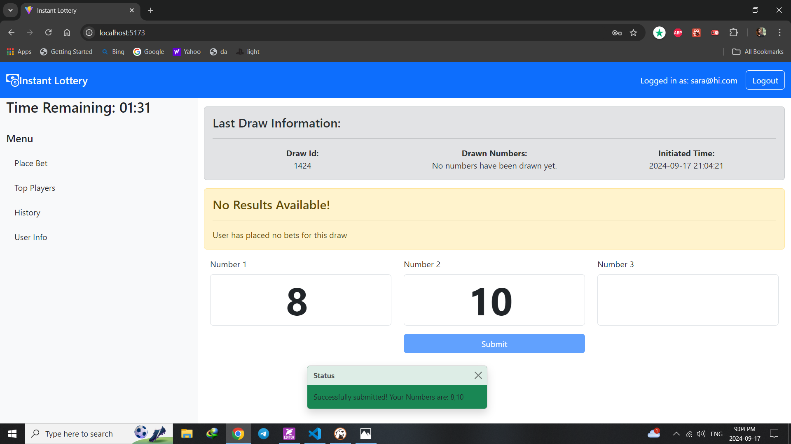
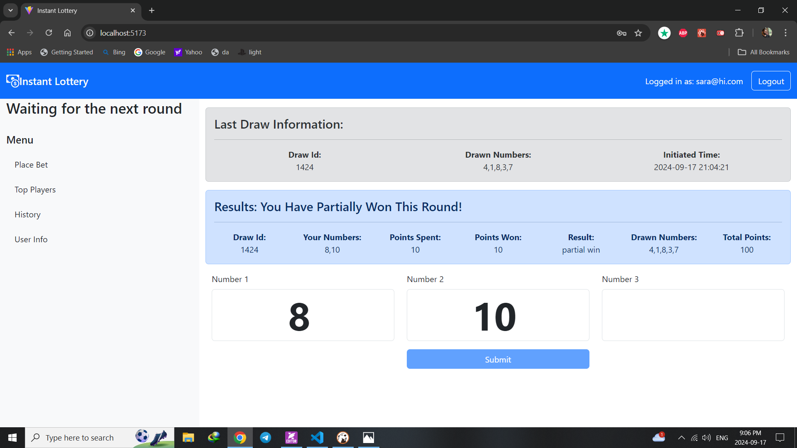

#  "Instant Lottery"

An online Instant Lottery web application, developed using JavaScript, React, Node.js, and SQLite;
where logged-in users can place bets on periodically drawn numbers. Every 2 minutes, 5 distinct random numbers (1-90) are drawn, and all players see the same numbers. Players can bet on 1-3 numbers, using points as currency (5, 10, or 15 points per bet). Each player starts with 100 points, and their balance only increases through winning bets. Once a player runs out of points, they can no longer bet. Non-logged users see the game rules and a login form.

## React Client Application Routes

- Route `/`: it is the parent route that includes DashboardLayout component and its children, it is the main page of app, if the user is not logged in it redirects to `/login`
  - Route `/placebet`: it is the index route of `/` that includes PlaceBet component and actually redirects to `/` , if the user is not logged in it redirects to `/login`
  - Route `/topplayers`: it is a child route of `/` that includes TopPlayers component which shows the top 3 players with the highest points
  - Route `/history`: it is a child route of `/` that includes HistoryTable component to show the betting history of the current logged-in user
  - Route `/userinfo`: it is a child route of `/` that includes UserInfo component to show the information about the currently logged-in user including their points
  - Route `/*`: it is a child route of `/` that includes NotFoundLayout component to show a 404 page
- Route `/login`: it includes LoginForm component, if the user is already logged in it redirects to `/`

## Main React Components

- `LoginForm` (in `Auth.jsx`): it is a form for login with username and password, also includes a description of the app
- `TopPlayers` (in `TopPlayers.jsx`): it is a component that shows the top 3 players with the highest points; it fetchs the top players in a useEffect hook
- `DashboardLayout` (in `DashboardLayout.jsx`): it is a layout component that includes the sidebar menu (`Filters.jsx`) and has the outlet for its children components, it also includes the timer component (`Timer.jsx`) and `NotFoundLayout` component
- `PlaceBet` (in `PlaceBet.jsx`): consists of a form with 3 input fields for the user to place a bet, does sanity checks on the input and shows error messages if needed, then submits the bet to the server; it include two bootstrap alerts for the inforamtion on the last draw and another one for the result of the user's bet
- `PlayersTable` (in `PlayersList.jsx`): it is a component that shows the top 3 players with the highest points; it fetchs the top players in a useEffect hook
- `Filters` (in `Filters.jsx`): it is a component that shows the sidebar menu with links to the main pages of the app
- `Timer` (in `Timer.jsx`): it is a component that shows the remaining time to place a bet for the current draw; the fetch and the state is managed in the `app.jsx` component
- `HistoryTable` (in `History.jsx`): it shows the betting history of the current logged-in user; it fetchs the history in a useEffect hook
- `UserInfo` (in `UserInfo.jsx`): it shows the information about the currently logged-in user; it fetchs the user information in a useEffect hook

(only _main_ components, minor ones may be skipped)

## API Server

- **POST `/api/sessions`**: Authenticate user and create a session.
  - **Request Body**: `{ username, password }`
  - **Response**: User details on successful login.
  - **Status Codes**: 
    - `200 OK` on successful login.
    - `401 Unauthorized` if the username or password is incorrect.
  - **Possible Errors**: `{ error: 'Incorrect username or password' }`.

- **GET `/api/sessions/current`**: Check if a user is logged in.
  - **Response**: `{ id, username, name }` if authenticated.
  - **Status Codes**: 
    - `200 OK` if logged in.
    - `401 Unauthorized` if not logged in.
  
- **DELETE `/api/sessions/current`**: Log out the current user.
  - **Response**: Empty response.
  - **Status Codes**: 
    - `200 OK` on successful logout.
  
- **POST `/api/bets`**: Place a new bet after validation.
  - **Request Body**: `{ numbers }` (Array of 1-3 distinct integers between 1 and 90).
  - **Validations**:
    - Array must have between 1 and 3 distinct numbers.
    - Each number must be between 1 and 90.
    - Users cannot bet if they have insufficient points or if the draw time has expired.
  - **Response**: `{ betId, numbers }` on success.
  - **Status Codes**:
    - `201 Created` if the bet is successfully placed.
    - `400 Bad Request` for validation failures like:
      - "The numbers must be distinct."
      - "You do not have enough points to bet."
      - "The time to bet on this draw has expired."
    - `503 Service Unavailable` for server errors.

- **GET `/api/top-players`**: Retrieve the top 3 players with the highest points.
  - **Response**: Array of top players `{ id, username, points }`.
  - **Status Codes**: 
    - `200 OK` on success.
    - `500 Internal Server Error` if data cannot be retrieved.
  
- **GET `/api/result`**: Get the result of the last draw along with the user's bet.
  - **Response**: `{ drawId, userNumbers, pointsSpent, pointsWon, result, drawnNumbers, totalPoints }`.
  - **Status Codes**:
    - `200 OK` if results are found.
    - `500 Internal Server Error` for server issues.
  
- **GET `/api/last-draw`**: Retrieve the numbers of the most recent draw (if available).
  - **Response**: `{ drawId, numbers, timestamp }`.
  - **Status Codes**: 
    - `200 OK` if the draw is retrieved successfully.
    - `500 Internal Server Error` if there are issues with fetching the data.
  
- **GET `/api/history`**: Get the betting history of the current logged-in user.
  - **Response**: Array of bets `{ betId, drawId, numbers, result, pointsSpent, pointsWon }`.
  - **Status Codes**:
    - `200 OK` if history is retrieved.
    - `500 Internal Server Error` if there is an issue retrieving the data.
  
- **GET `/api/remaining-time`**: Get the remaining time to place a bet for the current draw.
  - **Response**: `{ remainingTime }` in seconds.
  - **Status Codes**: 
    - `200 OK` if successful.
    - `503 Internal Server Error` if the timer is not initialized.

  
- **GET `/api/userinfo`**: Retrieve information about the currently logged-in user.
  - **Response**: `{ id, username, points, ... }`.
  - **Status Codes**: 
    - `200 OK` on success.
    - `500 Internal Server Error` if user information cannot be retrieved.

## Database Tables

- Table `users` 
  - `id`: primary key
  - `username`: text
  - `password`: text
  - `salt`: text
  - `points`: integer
  - `name`: text

- Table `draws` 
  - `id`: primary key autoincrement
  - `numbers`: text -- comma separated list of 5 numbers
  - `timestamp`: text  -- date and time of the draw

- Table `bets` 
  - `id`:  primary key autoincrement
  - `user_id`: integer -- foreign key to users table id
  - `draw_id`: integer -- foreign key to draws table id
  - `numbers`: text -- comma separated list of 1 to 3 numbers
  - `timestamp`: text  -- date and time of placing the bet
  - `points_spent`: integer default 0 -- points spent for the bet
  - `points_won`: integer default 0 -- points won in the bet
  - `result`: text -- win , lose or partial win
    - foreign key (user_id) references users(id)
    - foreign key (draw_id) references draws(id)

## Screenshots

## Users Credentials

- username, password (plus any other requested info)

- john@hi.com, testjohn  (has placed some bets)
- sara@hi.com, testsara  (has placed some bets)
- alex@hi.com, testalex  (has placed some bets)
- mike@hi.com, testmike
- mario@hi.com, testmario

